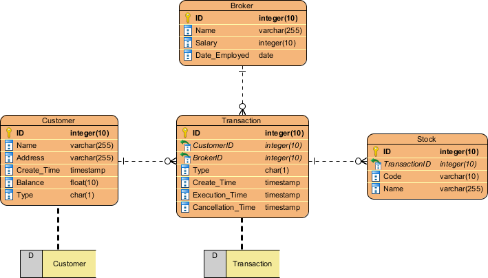

# Databases

A Database is a place to store gathered information and to organize it in a way where it can be retrieved later when it's needed.

The 4 main functions that a database needs are:
  - Inserting (creating) data
  - Retrieving data
  - Updating data
  - Deleting data

The simplest database would just be a single table. For example, a small business may use an excel spreadsheet to keep track of sales. Each sale would be a row of data, and each row of data would contain information such as customer name, address, product purchased, date of transaction etc. 

However, as databases grow, complications arise that can make creating, retrieving, updating, and deleting data difficult.

> If the same customer makes multiple purchases, their name and address data is copied with every purchase. This wastes space.  
> Also if the customer updates their address, every copy of their information has to be found and updated. This is time consuming and error prone. If an instance of the address is missed when updating, how will you know in the future which address is correct?

## Relational Databases

Relational databases consist of multiple tables that are all related to one another. This way Data such as a customer address can be stored in a single place, the customer table. And all the purchases that this customer makes can be stored in the purchases table.

So at first having multiple tables seems more complicated. But in reality it makes things much simpler as the datebase grows.

## Entity Relationship Diagram

Each table in a relational database is called an **entity**

An Entity Relaitonship Diagram (ERD) shows how all the tables are related to one another

## Relational Database Management Systems (RDBMS)

An **RDBMS** is software that lets you create and use Relational Databases.

#### Commercial
  - Oracle Database
  - IBM DB2
  - Microsoft SQL Server
  
#### Open Source
  - MySQL
  - SQLite
  - PostgreSQL
  
  
## SQL

SQL is the language used to work with relational databases. You can issue commands to create tables, insert a row of data, search for a row of data, etc.